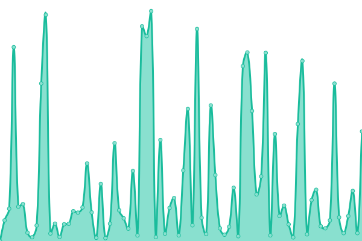
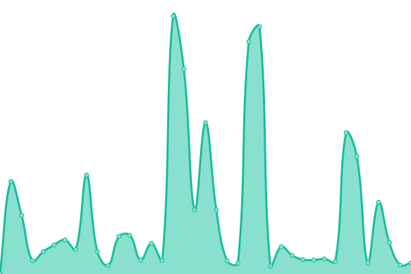
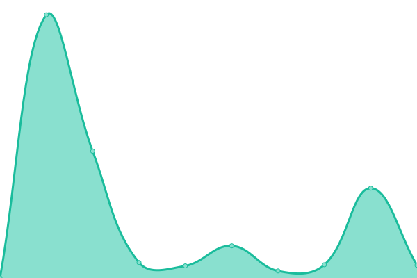
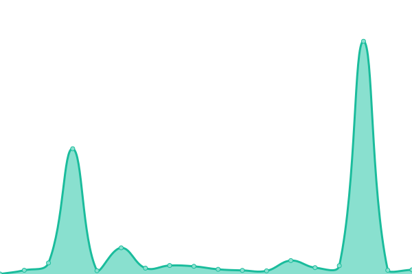
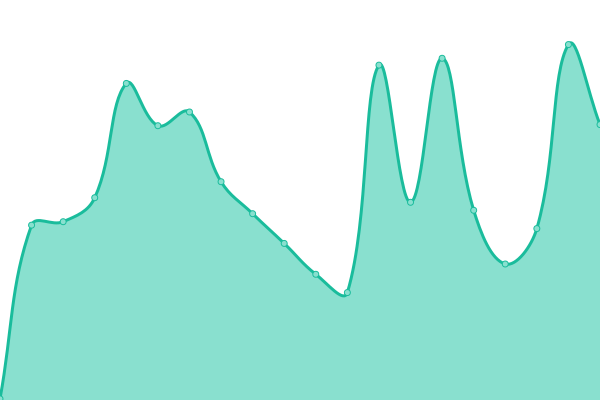
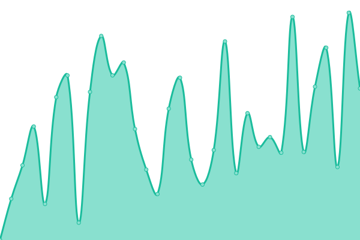
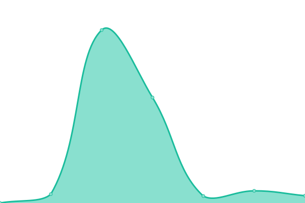
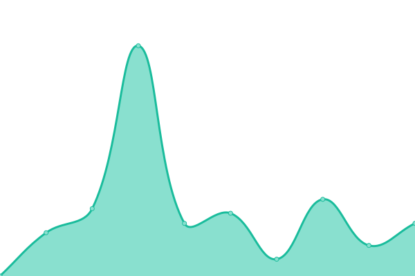

# [📈 Live Status](https://Cpluz.github.io/sitecheck): <!--live status--> **🟧 Partial outage**

This repository contains the open-source uptime monitor and status page for [Cpluz](cpluz.com), powered by [Upptime](https://github.com/upptime/upptime).

With [Upptime](https://upptime.js.org), you can get your own unlimited and free uptime monitor and status page, powered entirely by a GitHub repository. We use [Issues](https://github.com/Cpluz/sitecheck/issues) as incident reports, [Actions](https://github.com/Cpluz/sitecheck/actions) as uptime monitors, and [Pages](https://Cpluz.github.io/sitecheck) for the status page.

<!--start: status pages-->
<!-- This summary is generated by Upptime (https://github.com/upptime/upptime) -->
<!-- Do not edit this manually, your changes will be overwritten -->
<!-- prettier-ignore -->
| URL | Status | History | Response Time | Uptime |
| --- | ------ | ------- | ------------- | ------ |
|  [Cpluz](https://www.cpluz.com) | 🟥 Down | [cpluz.yml](https://github.com/Cpluz/sitecheck-temp/commits/HEAD/history/cpluz.yml) | 

 12740ms
     
 | 

<a href="https://Cpluz.github.io/sitecheck/history/cpluz">33.65%</a>
    

|  [Cpluz Accounts](https://acc.cpluz.com) | 🟩 Up | [cpluz-accounts.yml](https://github.com/Cpluz/sitecheck-temp/commits/HEAD/history/cpluz-accounts.yml) | 

 13512ms
     
 | 

<a href="https://Cpluz.github.io/sitecheck/history/cpluz-accounts">48.02%</a>
    

|  [Z Accounts](https://accounts.cpluz.com) | 🟩 Up | [z-accounts.yml](https://github.com/Cpluz/sitecheck-temp/commits/HEAD/history/z-accounts.yml) | 

 3615ms
     
 | 

<a href="https://Cpluz.github.io/sitecheck/history/z-accounts">85.52%</a>
    

|  [S Accounts](https://accounts.cpluz.in) | 🟩 Up | [s-accounts.yml](https://github.com/Cpluz/sitecheck-temp/commits/HEAD/history/s-accounts.yml) | 

 382ms
     
 | 

<a href="https://Cpluz.github.io/sitecheck/history/s-accounts">23.07%</a>
    

|  [Serverify](https://serverify.in) | 🟩 Up | [serverify.yml](https://github.com/Cpluz/sitecheck-temp/commits/HEAD/history/serverify.yml) | 

 1556ms
     
 | 

<a href="https://Cpluz.github.io/sitecheck/history/serverify">100.00%</a>
    

|  [Vasanthamdoors](https://vasanthamdoors.com) | 🟩 Up | [vasanthamdoors.yml](https://github.com/Cpluz/sitecheck-temp/commits/HEAD/history/vasanthamdoors.yml) | 

 2367ms
     
 | 

<a href="https://Cpluz.github.io/sitecheck/history/vasanthamdoors">100.00%</a>
    

|  [Ispearexports](https://ispearexports.com) | 🟩 Up | [ispearexports.yml](https://github.com/Cpluz/sitecheck-temp/commits/HEAD/history/ispearexports.yml) | 

 3776ms
     
 | 

<a href="https://Cpluz.github.io/sitecheck/history/ispearexports">100.00%</a>
    

|  [Shrijayan](https://shrijayan.cpluz.com) | 🟩 Up | [shrijayan.yml](https://github.com/Cpluz/sitecheck-temp/commits/HEAD/history/shrijayan.yml) | 

 8737ms
     
 | 

<a href="https://Cpluz.github.io/sitecheck/history/shrijayan">68.38%</a>
    

|  [GPU Calculator](https://calgpu.cpluz.com) | 🟩 Up | [gpu-calculator.yml](https://github.com/Cpluz/sitecheck-temp/commits/HEAD/history/gpu-calculator.yml) | 

 941ms
     
 | 

<a href="https://Cpluz.github.io/sitecheck/history/gpu-calculator">85.76%</a>
    

|  [Aameco](https://aameco.in) | 🟩 Up | [aameco.yml](https://github.com/Cpluz/sitecheck-temp/commits/HEAD/history/aameco.yml) | 

 12372ms
     
 | 

<a href="https://Cpluz.github.io/sitecheck/history/aameco">92.72%</a>
    

|  [Kingtraderss](https://kingtraderss.com) | 🟩 Up | [kingtraderss.yml](https://github.com/Cpluz/sitecheck-temp/commits/HEAD/history/kingtraderss.yml) | 

 9879ms
     
 | 

<a href="https://Cpluz.github.io/sitecheck/history/kingtraderss">96.70%</a>
    

|  [Accounts Kingtraderss](https://accounts.kingtraderss.com) | 🟥 Down | [accounts-kingtraderss.yml](https://github.com/Cpluz/sitecheck-temp/commits/HEAD/history/accounts-kingtraderss.yml) | 

 461ms
     
 | 

<a href="https://Cpluz.github.io/sitecheck/history/accounts-kingtraderss">0.00%</a>
    

|  [Inventory Kingtraderss](https://inventory.kingtraderss.com) | 🟩 Up | [inventory-kingtraderss.yml](https://github.com/Cpluz/sitecheck-temp/commits/HEAD/history/inventory-kingtraderss.yml) | 

 432ms
     
 | 

<a href="https://Cpluz.github.io/sitecheck/history/inventory-kingtraderss">0.00%</a>
    

|  [Baseefy](https://baseefy.com) | 🟩 Up | [baseefy.yml](https://github.com/Cpluz/sitecheck-temp/commits/HEAD/history/baseefy.yml) | 

 874ms
     
 | 

<a href="https://Cpluz.github.io/sitecheck/history/baseefy">99.92%</a>
    

|  [Winnovin](https://winnovin.com) | 🟥 Down | [winnovin.yml](https://github.com/Cpluz/sitecheck-temp/commits/HEAD/history/winnovin.yml) | 

 0ms
     
 | 

<a href="https://Cpluz.github.io/sitecheck/history/winnovin">0.00%</a>
    

|  [Inventory Winnovin](https://inventory.winnovin.com) | 🟥 Down | [inventory-winnovin.yml](https://github.com/Cpluz/sitecheck-temp/commits/HEAD/history/inventory-winnovin.yml) | 

 0ms
     
 | 

<a href="https://Cpluz.github.io/sitecheck/history/inventory-winnovin">0.00%</a>
    

|  [Viyaanexport](https://viyaanexport.com) | 🟩 Up | [viyaanexport.yml](https://github.com/Cpluz/sitecheck-temp/commits/HEAD/history/viyaanexport.yml) | 

 12277ms
     
 | 

<a href="https://Cpluz.github.io/sitecheck/history/viyaanexport">92.81%</a>
    

|  [Vihandesigns COM](https://vihandesigns.com) | 🟩 Up | [vihandesigns-com.yml](https://github.com/Cpluz/sitecheck-temp/commits/HEAD/history/vihandesigns-com.yml) | 

 433ms
     
 | 

<a href="https://Cpluz.github.io/sitecheck/history/vihandesigns-com">100.00%</a>
    

|  [Vihandesigns IN](https://vihandesigns.in) | 🟩 Up | [vihandesigns-in.yml](https://github.com/Cpluz/sitecheck-temp/commits/HEAD/history/vihandesigns-in.yml) | 

 378ms
     
 | 

<a href="https://Cpluz.github.io/sitecheck/history/vihandesigns-in">54.17%</a>
    

|  [Skyaloft](https://skyaloft.com) | 🟩 Up | [skyaloft.yml](https://github.com/Cpluz/sitecheck-temp/commits/HEAD/history/skyaloft.yml) | 

 13467ms
     
 | 

<a href="https://Cpluz.github.io/sitecheck/history/skyaloft">95.62%</a>
    

|  [Lunux](https://lunux.in) | 🟩 Up | [lunux.yml](https://github.com/Cpluz/sitecheck-temp/commits/HEAD/history/lunux.yml) | 

 10714ms
     
 | 

<a href="https://Cpluz.github.io/sitecheck/history/lunux">99.01%</a>
    

|  [Fuwaindia](https://fuwaindia.in) | 🟩 Up | [fuwaindia.yml](https://github.com/Cpluz/sitecheck-temp/commits/HEAD/history/fuwaindia.yml) | 

 413ms
     
 | 

<a href="https://Cpluz.github.io/sitecheck/history/fuwaindia">99.78%</a>
    

|  [Everyhue](https://everyhue.in) | 🟩 Up | [everyhue.yml](https://github.com/Cpluz/sitecheck-temp/commits/HEAD/history/everyhue.yml) | 

 201ms
     
 | 

<a href="https://Cpluz.github.io/sitecheck/history/everyhue">99.83%</a>
    

<!--end: status pages-->

[**Visit our status website →**](https://Cpluz.github.io/sitecheck)

## 📄 License

- Powered by: [Upptime](https://github.com/upptime/upptime)
- Code: [MIT](./LICENSE) © [Anand Chowdhary](https://anandchowdhary.com), supported by [Pabio](https://pabio.com)
- Data in the `./history` directory: [Open Database License](https://opendatacommons.org/licenses/odbl/1-0/)
